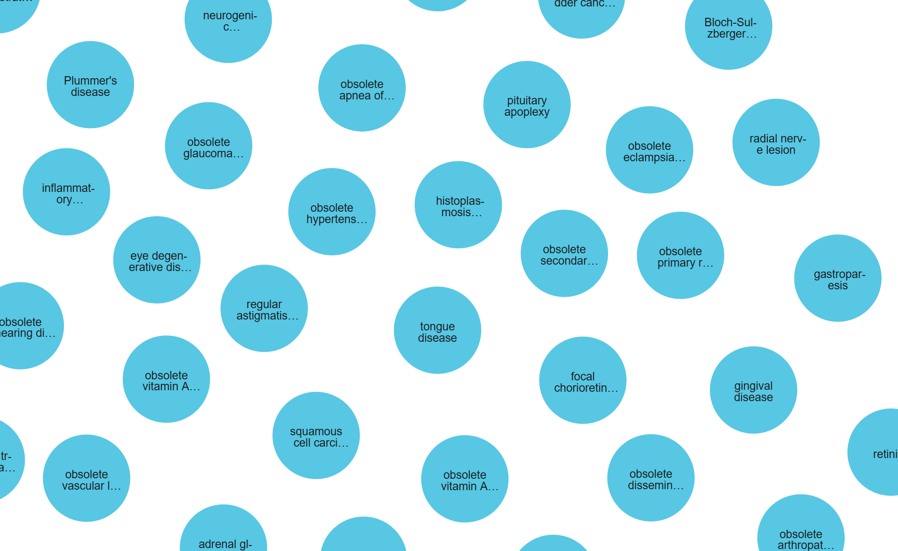
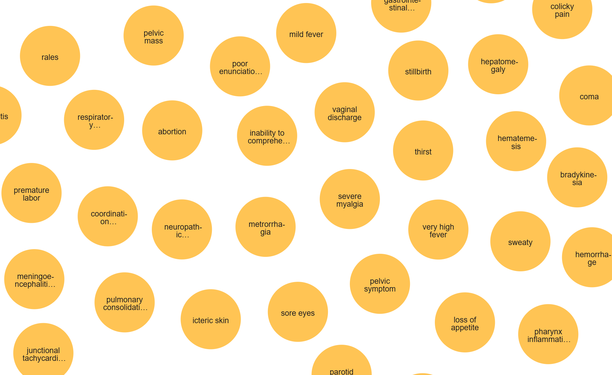
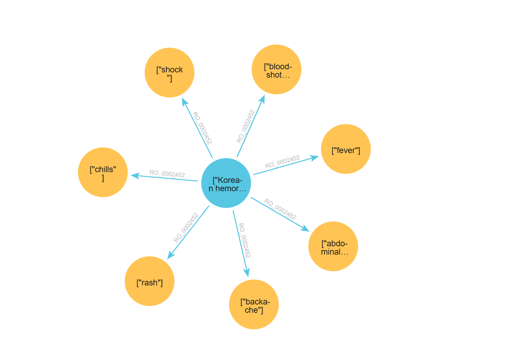
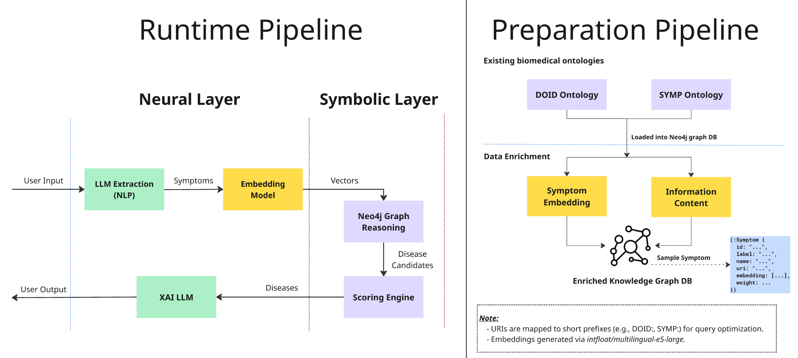

# 🌟 Overview

NeSy is a diagnostic assistance framework that bridges the gap between neural natural language processing and symbolic knowledge representation. By integrating Large Language Models (LLMs) with a Knowledge Graph (Neo4j), the system provides a robust pipeline for disease inference based on standardized medical ontologies.

## 🧬 Biomedical Ontologies

NeSy grounds its symbolic reasoning in standardized, peer-reviewed medical ontologies. This ensures that the system's knowledge base is medically accurate, hierarchically structured, and free from the hallucinations typical of pure LLM approaches.

* **DOID (Human Disease Ontology):** A standardized map of human diseases. It allows the system to understand the relationships between different medical conditions.

  

* **SYMP (Symptom Ontology):** Provides a standardized vocabulary for clinical signs and symptoms. NeSy uses this to extract, classify, and mathematically weight the symptoms reported by the user.

  

### 🔗 The Connection (RO_0002452)

In the world of medical data, the link between a disease and its symptoms is formally called RO_0002452 (simply meaning `has symptom`).

By mapping DOID diseases to SYMP symptoms via the `RO_0002452` relationship, NeSy constructs the foundational Knowledge Graph required for precise, neuro-symbolic inference.



# 🏗️ System Architecture

The system is divided into two primary workflows: the **Runtime Pipeline** and the **Preparation Pipeline**.



## ⚙️ Preparation Pipeline

The preparation phase is a two-step process:

### Step 1: ***Ontology loading***

Existing biomedical ontologies (DOID and SYMP) are parsed and loaded into the Neo4j Graph Database.

- This establishes the initial symbolic structure, mapping diseases to symptoms through hierarchical relationships.

- URIs are mapped to short prefixes (e.g., DOID:, SYMP:) to optimize storage and query performance.

### Step 2 ***Data Enrichment***

Before the system can perform inferences, it undergoes a data enrichment phase:

- **Symptom Embedding**: Generates high-dimensional vector representations for symptoms using the ```intfloat/multilingual-e5-large model```.

- **Information Content (IC)**: Calculates IC metrics to weight the significance of each symptom within the graph hierarchy as follows:
  
    $$IC(s) = \log \left( \frac{N_{total}}{f(s) + 1} \right)$$
  
  Where:
  
  - $N_{total}$ is the total number of diseases in the database.
  - $f(s)$ is the frequency of symptom $s$ (the number of diseases that feature this symptom).
  - The $+1$ term is a smoothing factor to ensure stability.

  This counts how many diseases reference a specific symptom via the `RO_0002452` (has symptom) relationship and assigns the calculated IC score.

   The resulting `IC` is permanently stored as the `weight` property on each `Symptom` node within the Neo4j graph. This shifts the heavy mathematical   computation to the preparation phase.

- **Enriched Graph**: Stores nodes with attributes like URIs, labels, embeddings, and weights in a Neo4j Graph DB.

## ⚡Runtime Pipeline

The active diagnostic process follows a neuro-symbolic approach:

### 🟢 Neural Layer 

- **LLM Extraction (NLP)**: The system uses an LLM to parse unstructured user input. It identifies mentions of clinical signs and symptoms, filtering out noise and irrelevant context to isolate core medical entities.

- **Embedding Model**: Extracted symptoms are passed through the ```intfloat/multilingual-e5-large model``` model. This transforms text into high-dimensional vectors (embeddings). This step is crucial for Semantic Search, allowing the system to understand that "headache" and "cephalalgia" are semantically identical, even if the exact words differ.

- **XAI LLM (Explainable AI)**: Acts as the final synthesis bridge. It takes the structured inference results from the Symbolic Layer and translates them into natural language explanations, ensuring the diagnostic process is transparent and interpretable for the end-user. Instead of just showing a score, it generates a transparent explanation: "Based on the reported symptom of [Symptom A], which is a high-weighted indicator for [Disease B] in the DOID ontology..."

### 🟣 Symbolic Layer:

- **Neo4j Graph Reasoning**: This is the core of the "Symbolic" engine. It performs a Vector Similarity Search between the user's symptom embeddings and the pre-computed embeddings stored in the graph. Once matches are found, it traverses the symbolic relationships (e.g., RO_0002452 - has_symptom) to find all diseases connected to the identified symptoms within the DOID/SYMP hierarchy.

- **Scoring Engine**: Disease ranking is not a simple count of matching symptoms. Instead, it utilizes a sophisticated Normalized Weighted Sum approach:

  - **Weighted Sum** (```total_score```): The Neo4j engine identifies diseases connected to the user's symptoms and sums the pre-calculated weights (IC) of all matching symptoms.
    
    $$total\_{score} = \sum IC(matched\_{symptoms})$$
  
  - **Square Root Normalization** (```normalized_score```): To prevent "broad" diseases (those with a high number of general symptoms) from unfairly dominating the results, we normalize the score by the square root of the total number of symptoms associated with that disease.

    $$normalized\_{score} = \frac{total\_{score}}{\sqrt{count(disease\_{symptoms})}}$$
  
**Key advantages of this approach**:

- **Specificity over Quantity**: A disease with two highly specific (high IC) symptoms can outrank a disease with ten common (low IC) symptoms.

- **Bias Mitigation**: The square root normalization ensures a fair balance between specific diagnostic indicators and the overall complexity of the disease profile.

# 📂 Project Structure

```
NeSy/
├── _includes/          # Custom HTML headers for GitHub Pages (e.g., MathJax integration)
├── assets/
│   └── images/         # Architecture diagrams and graph visualizations
├── backend/            # FastAPI application, core reasoning logic, and API endpoints
│   └── README.md       # Backend-specific installation and setup guide
├── notebooks/          # Jupyter notebooks for Knowledge Graph enrichment (IC & embeddings)
│   └── README.md       # Jupyter setup and execution instructions
├── .gitignore          # Ignored files and directories
├── _config.yml         # Jekyll configuration for GitHub Pages deployment
├── index.md            # GitHub Pages entry point
├── LICENSE             # Open-source license (e.g., MIT)
└── README.md           # This file (Project overview and general instructions)
```
