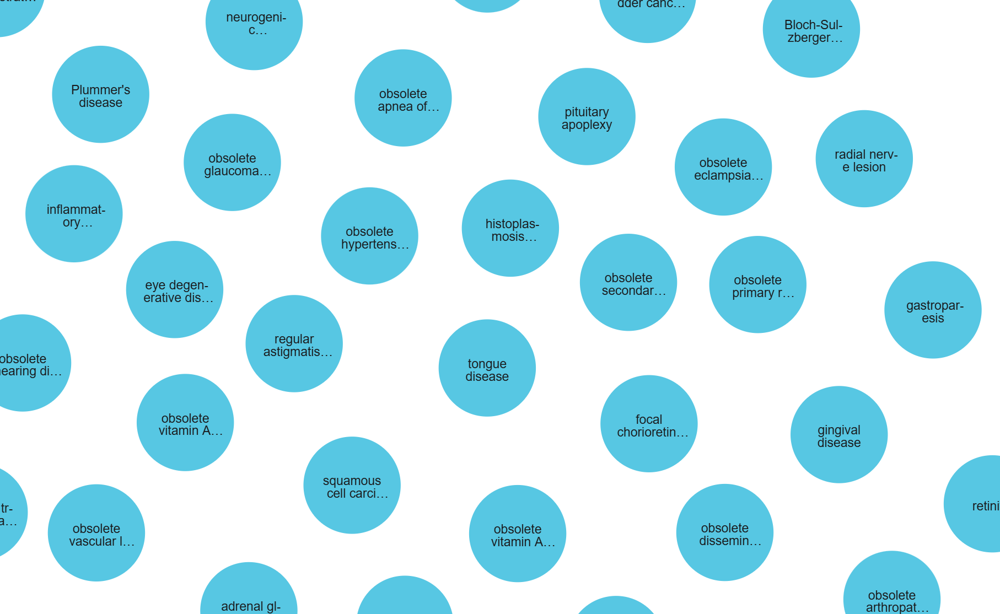
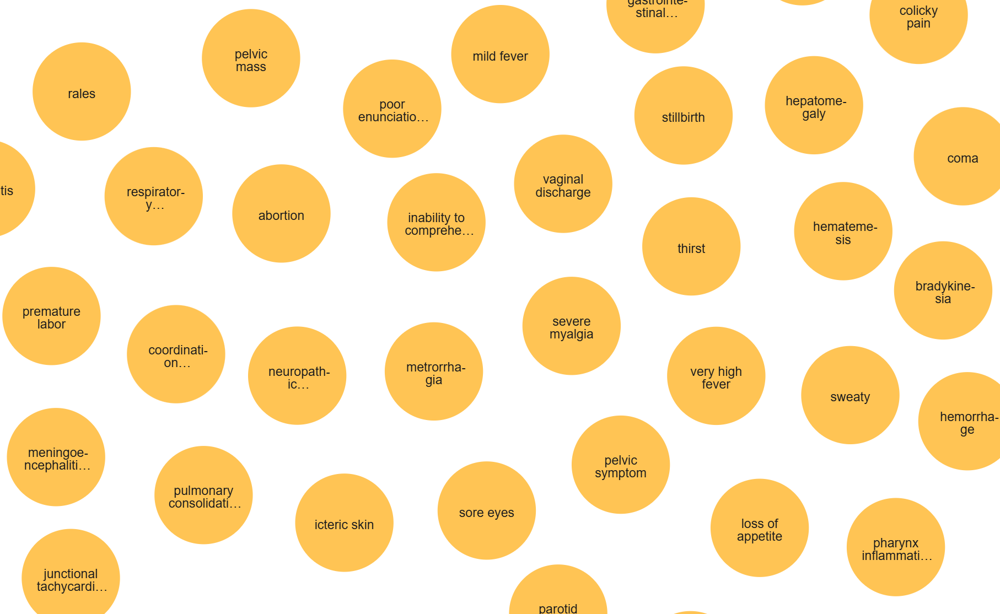
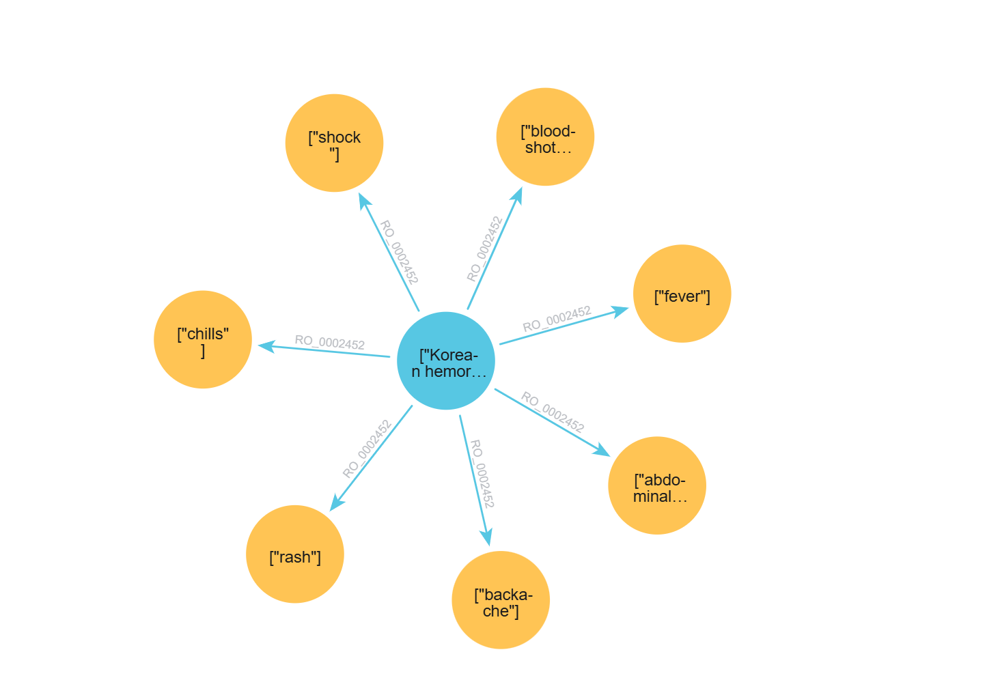
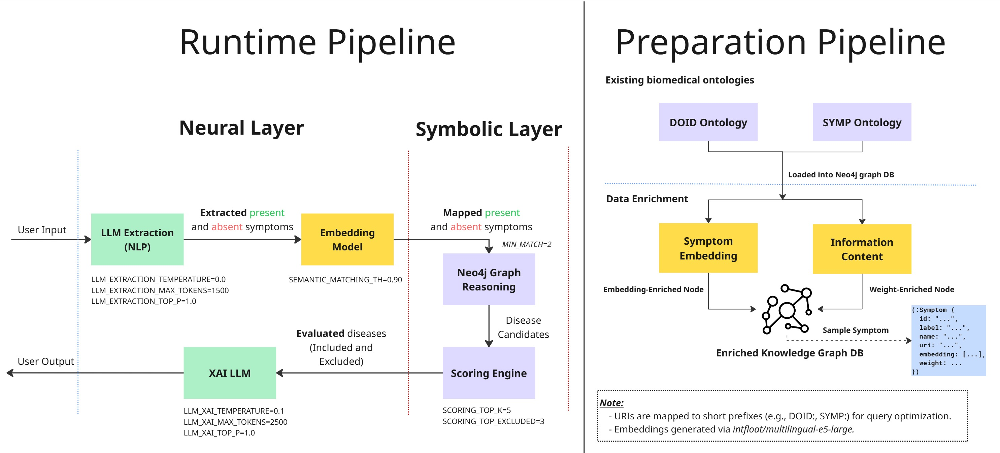

[](https://nemanjaase.github.io/NeSy/)

<h1 align="center">NeSy-X: Neuro-Symbolic eXplainable Framework</h1>

<p align="center">
  A research framework for diagnostic support
</p>

<p align="center">
  
  
  
  
  <br>
  
  
  
  
</p>

## Overview

**NeSy-X (Neuro-Symbolic eXplainable framework)** combines large language models (LLMs), text vector representations, biomedical ontologies, and a knowledge graph for diagnostic support.

The neural layer extracts present and explicitly negated symptoms from unstructured user text and maps them to ontological concepts. The symbolic layer retrieves, scores, and ranks candidate diseases using explicit disease-symptom relations. The explainable AI (XAI) layer generates structured explanations from these results.

The LLM is therefore a component for language processing and explanation generation, not a standalone diagnostic mechanism.

> **Research prototype:** NeSy-X has been evaluated on controlled examples and ontology-derived datasets, not on real patient data. It is not clinically validated and must not be used for medical diagnosis or treatment decisions.

## Research Contributions

Developed as part of a master's thesis, the framework brings together:

- **Neuro-symbolic integration:** separation of neural text processing from symbolic reasoning over a knowledge graph.
- **Knowledge graph enrichment:** symptom nodes enriched with text vector representations and Information Content (IC) weights.
- **Weighted disease scoring:** a scoring mechanism based on matched symptom weights and square-root normalization.
- **Negated-symptom filtering:** an explicit rule for separating included and excluded disease candidates.
- **Component-level evaluation:** tests of symptom extraction, semantic mapping, disease ranking, negated-symptom filtering, and explanation generation.
- **Local and cloud execution:** comparison of LLMs under the tested deployment conditions.

The architecture supports four properties:

| Property | Meaning in NeSy-X |
|---|---|
| Traceability | Following the processing steps from user input through extracted symptoms, mapped concepts, and ranked results. |
| Verifiability | Checking symbolic results against the graph relations, symptom weights, and filtering rules used to obtain them. |
| Explainability | Presenting understandable reasons for disease ranking and exclusion. |
| Controllability | Configuring similarity thresholds, minimum symptom matches, filtering rules, and result limits. |

These properties support transparency of the processing workflow. They do not make the internal operation of the LLM fully transparent or guarantee the correctness of its outputs.

## Biomedical Ontologies and Knowledge Graph

The symbolic layer uses the **Human Disease Ontology (DO)** and the **Symptom Ontology (SYMP)**. In the terminology used here, **DO** names the ontology, while **DOID** is its concept identifier prefix.

The following versions and counts describe the graph snapshot documented in the thesis, not the latest ontology releases:

| Ontology | Version used | Role | Source |
|---|---|---|---|
| Human Disease Ontology (DO) | 2025-09-30 | Disease concepts and their relations | [Ontology repository](https://github.com/DiseaseOntology/HumanDiseaseOntology/tree/main/src/ontology) |
| Symptom Ontology (SYMP) | 2024-05-17 | Standardized symptom concepts | [Ontology releases](https://github.com/DiseaseOntology/SymptomOntology/releases) |

| Graph element | Reported count |
|---|---:|
| Disease nodes | 14,460 |
| Symptom nodes | 1,019 |
| Relations identified by the `has symptom` restriction query | 2,259 |

Not every disease node has a symptom profile suitable for ranking. The ranking evaluation uses a smaller, eligible subset.

### Disease and Symptom Nodes



```cypher
MATCH (d:Disease)
RETURN count(d) AS disease_count;
```



```cypher
MATCH (s:Symptom)
RETURN count(s) AS symptom_count;
```

### Disease-Symptom Relations

The framework identifies disease-symptom associations using the relation URI `http://purl.obolibrary.org/obo/RO_0002452` (`has symptom`).

The [implemented inference query](./backend/app/infrastructure/database/neo4j/queries/infer_diseases.cyp) traverses a relationship directly between `Disease` and `Symptom` nodes:

```cypher
MATCH (d:Disease)-[r:n4sch__SCO_RESTRICTION]->(s:Symptom)
WHERE r.onPropertyURI = "http://purl.obolibrary.org/obo/RO_0002452"
RETURN d, s, r;
```

Here, `n4sch__SCO_RESTRICTION` is the relationship type used in the imported graph, and `onPropertyURI` identifies the relevant ontological relation. This is the graph representation consumed by the application; it should not be confused with the serialization of anonymous restrictions in an OWL/RDF source document.

The restriction-count query reported in the thesis is:

```cypher
MATCH ()-[r:n4sch__SCO_RESTRICTION]->()
WHERE r.onPropertyURI = "http://purl.obolibrary.org/obo/RO_0002452"
RETURN count(r) AS has_symptom_relations;
```



In this project, **symbolic reasoning** refers to explicit graph queries, weighted scoring, and rule-based filtering. It does not imply that Neo4j performs complete OWL description-logic reasoning or that ontology coverage guarantees clinical accuracy.

## Framework Workflow

NeSy-X is organized into a **preparation phase** and an **execution phase**.



In the diagram, **Preparation Pipeline** and **Runtime Pipeline** correspond to the preparation and execution phases; **Embedding Model** denotes the text vector representation model, and **absent** denotes explicitly negated symptoms.

### Preparation Phase

#### 1. Ontology Loading

DO and SYMP concepts and relations are imported into Neo4j using neosemantics (`n10s`). Relevant concept nodes are assigned the `Disease` and `Symptom` labels for subsequent queries.

See the [Neo4j setup guide](./docs/neo4j_setup.md) and the [notebook workflow](./notebooks/README.md).

#### 2. Symptom Weight Calculation

Symptom weights are based on Information Content:

$$
IC(s) = \ln\left(\frac{N}{\operatorname{freq}(s)+1}\right)
$$

- $N$ is the total number of disease nodes in the graph.
- $\operatorname{freq}(s)$ is the number of disease associations counted for symptom $s$ by the preparation query.
- The $+1$ term smooths the denominator.
- $\ln$ is the natural logarithm, corresponding to Cypher's [`log()` function](https://neo4j.com/docs/cypher-manual/current/functions/mathematical-logarithmic/#functions-log).

Symptoms associated with fewer diseases in the graph receive higher weights. This expresses specificity within the imported graph, not symptom prevalence or diagnostic importance measured in a patient population.

The calculated weight is stored in the symptom node's `weight` property. Weights must be recalculated when the relevant graph data changes.

#### 3. Text Vector Representations

Symptom nodes are enriched with vector representations of their textual labels using `intfloat/multilingual-e5-large`.

Each representation is a numerical vector stored in the node's `embedding` property. During execution, these vectors are compared with representations of extracted symptom expressions to support semantic mapping.

### Execution Phase

#### 1. Symptom Extraction: Neural Layer

An LLM processes unstructured user text and extracts:

- **Present symptoms:** symptoms explicitly reported as present.
- **Negated symptoms:** symptoms explicitly reported as absent.

The extraction prompt requests separate symptom expressions, valid structured output, and no independent diagnosis or addition of unstated symptoms.

The implementation uses field names such as `present` and `absent`. In this README, **negated symptoms** refers specifically to explicit negation, not to symptoms that the user simply did not mention.

#### 2. Semantic Mapping: Neural Layer

Extracted expressions are encoded using the same text vector representation model as the ontology labels. Each expression is compared with SYMP concepts using cosine similarity:

$$
\operatorname{sim}(A,B)=\frac{A\cdot B}{\lVert A\rVert\lVert B\rVert}
$$

$A$ is the vector representation of the extracted expression, and $B$ is the representation of a symptom concept in the graph.

The most similar concept is accepted only when the similarity reaches the configured threshold, **0.90 in the evaluated configuration**. Present and negated symptoms are processed separately.

In the current backend, this comparison is performed by the [Python semantic matcher](./backend/app/domain/services/semantic_matcher.py), using ontology vectors retrieved from Neo4j. It is not a Neo4j vector-index search.

Cosine similarity is not a probability of correctness. Similar expressions can still refer to clinically different concepts.

#### 3. Graph-Based Reasoning and Disease Scoring: Symbolic Layer

The symbolic layer retrieves candidate diseases connected to the mapped present symptoms. Candidates must satisfy the minimum number of matches, **`MIN_MATCH = 2` in the evaluated configuration**.

For disease $d$, let $S(d)$ be its symptom set in the graph and $M(d)$ the subset matching mapped present symptoms. With $w(s)=IC(s)$:

$$
\operatorname{Score}_{raw}(d)=\sum_{s\in M(d)}w(s)
$$

$$
\operatorname{Score}_{norm}(d)=
\frac{\sum_{s\in M(d)}w(s)}{\sqrt{|S(d)|}}
$$

The weighted sum accounts for symptom specificity within the graph. Square-root normalization reduces the advantage of disease profiles associated with many symptoms.

These are ranking scores, not calibrated disease probabilities.

#### 4. Negated-Symptom Filtering: Symbolic Layer

Let $A_{\mathrm{neg}}$ be the set of mapped negated symptoms. The **blocking symptoms** for a disease are:

$$
B(d)=S(d)\cap A_{\mathrm{neg}}
$$

A candidate passes the filter only when $B(d)$ is empty. Otherwise, it is marked as excluded, even if its normalized score is high. Excluded candidates can be retained separately to explain the filtering decision.

This is an explicit rule of the framework. Exclusion from its ranked results is not proof that a disease is clinically impossible.

#### 5. Explanation Generation: XAI Layer

The XAI layer receives structured symbolic results, including:

- disease name and identifier;
- normalized score and filter status;
- matched symptoms;
- missing symptoms;
- blocking symptoms.

Here, **missing symptoms** are disease-profile symptoms not included among the matched present symptoms; they are not automatically treated as explicitly negated.

The LLM is instructed to explain the ranking and filtering decisions without overriding the symbolic results. This makes explanations easier to relate to the underlying graph data. However, generated wording can still introduce unsupported content and requires review.

## Component-Level Evaluation

Evaluation focuses on the behavior of individual components under controlled conditions. The results below are based on the saved repository outputs; they are not clinical diagnostic accuracy measurements.

### Symptom Extraction

Seven locally or cloud-executed LLMs were evaluated on **100 test cases**. The F1 values are averages of per-case scores, described in the thesis as a macro-average over test cases.

| Model | Execution | Mean per-case F1 |
|---|---|---:|
| `qwen2.5:14b` | Local | **0.825** |
| `llama3:8b` | Local | 0.800 |
| `mistral-nemo:12b` | Local | 0.790 |
| `phi4:14b` | Local | 0.772 |
| `meta-llama/llama-4-scout-17b-16e-instruct` | Cloud | 0.769 |
| `llama3.2:3b` | Local | 0.731 |
| `openai/gpt-oss-120b` | Cloud | 0.689 |

`qwen2.5:14b` achieved the highest mean per-case F1 in this evaluation.

Some evaluated models combined separately expected symptoms into compound expressions. This represents a **deviation from atomic symptom extraction** under the task's annotation rules, not evidence that larger models are generally less capable.

Sources: [saved extraction reports](./notebooks/tests/nlp-extraction-test/results/) and [evaluation methodology](./docs/nlp-test.md).

### Semantic Mapping

Three text vector representation models were compared on **369 symptom expressions**:

- **EXACT:** 180 exact ontology labels.
- **SYN:** 70 synonyms and descriptive expressions.
- **LLM:** 119 expressions obtained from LLM extraction outputs.

| Model | Vector dimension | Mean cosine similarity | Mappings at or above 0.90 |
|---|---:|---:|---:|
| `sentence-transformers/all-MiniLM-L6-v2` | 384 | 0.915 | 72.9% |
| `NeuML/pubmedbert-base-embeddings` | 768 | 0.918 | 72.4% |
| `intfloat/multilingual-e5-large` | 1024 | **0.978** | **94.0%** |

Means are computed across all 369 saved examples and rounded to three decimal places. The last column corresponds to the thesis's **usable mapping rate**, defined operationally as the share of mappings meeting the similarity threshold.

`intfloat/multilingual-e5-large` was selected based on these results. Neither mean similarity nor the usable mapping rate independently measures whether the chosen concept is clinically correct.

Sources: [saved mapping results](./notebooks/tests/embeddings-test/results/) and [evaluation methodology](./docs/embedding-test.md).

### Disease Ranking

The symbolic ranking component was tested using disease-symptom profiles derived from the ontologies. The initial eligible set contained **424 diseases**, each with at least two associated symptoms.

**Hit@k** is the proportion of test cases in which the expected disease appears among the first $k$ ranked candidates.

| Scenario | Test cases | No-result cases | Hit@1 | Hit@3 | Hit@5 |
|---|---:|---:|---:|---:|---:|
| All symptoms | 424 | 0 | **85.4%** | 92.0% | 93.2% |
| One symptom removed | 424 | 116 | 57.3% | 67.7% | 71.2% |
| Two symptoms removed | 308 | 78 | 50.0% | 63.0% | 67.9% |

The full-match Hit@5 value is **395/424 = 93.2%**, as recorded in the [saved full-match result](./notebooks/tests/inference-and-scoring-test/results/inference-full-test.json).

Removing symptoms reduces performance and can cause inputs to fall below the minimum-match threshold. The two-symptom-removal scenario uses a smaller eligible set, so the scenarios do not all have the same denominator.

The ranker uses graph relations and deterministic scoring without a separately trained disease classifier. The complete framework still uses machine learning through its LLMs and text vector representation model.

Sources: [saved ranking results](./notebooks/tests/inference-and-scoring-test/results/) and [evaluation methodology](./docs/inference-and-scoring-test.md).

### Negated-Symptom Filtering

The filter was checked on **1,263 controlled test cases**. Each case supplied a negated symptom associated with a related disease but absent from the target disease's graph profile.

| Metric | Result |
|---|---:|
| Related diseases correctly excluded | 1,263 / 1,263 |
| Target diseases correctly retained | 1,263 / 1,263 |
| Exclusion accuracy | 100% |
| Retention accuracy | 100% |

The saved result calls retention accuracy `survival_accuracy`. These values confirm rule consistency on the constructed test set, not a 100% clinically correct exclusion rate.

Source: [saved exclusion results](./notebooks/tests/inference-and-scoring-test/results/inference-exclusion-test.json).

### Explanation Generation

The thesis evaluates XAI behavior qualitatively across four selected scenarios. The assessment examines whether explanations use the supplied symbolic results, preserve filter status, and identify blocking symptoms when explaining exclusions.

This is a check of explanation consistency, not an independent clinical validation of generated advice. See the [XAI evaluation](./docs/xai-test.md) and [saved explanation outputs](./notebooks/tests/xai-llm-test/results/).

## Implementation and Project Structure

The implementation consists of a **React client**, a **FastAPI backend**, a **Neo4j knowledge graph**, and integrations for local or cloud LLM execution.

```text
NeSy/
|-- frontend/           # React client
|-- backend/            # FastAPI application and processing services
|-- data/               # Database snapshot
|-- notebooks/          # Graph enrichment and component evaluation
|-- docs/               # Setup guides and evaluation reports
|-- assets/images/      # Diagrams and graph visualizations
|-- _config.yml         # GitHub Pages configuration
|-- index.md            # GitHub Pages entry page
|-- LICENSE
|-- README.md
```

## Limitations

- **Ontology coverage:** only disease and symptom concepts and relations present in the graph can contribute to symbolic ranking.
- **Symptom extraction:** outputs depend on input wording, model selection, and prompt design; extraction errors can propagate to later stages.
- **Semantic mapping:** high cosine similarity does not guarantee that two expressions represent the same clinical concept.
- **Filtering assumptions:** the negated-symptom filter enforces a graph-based rule, not a complete model of clinical variability.
- **Explanation generation:** generated explanations may contain unsupported statements even when their input is structured.
- **Evaluation scope:** controlled and ontology-derived tests do not establish performance on real patient data or independent clinical populations.
- **Multilingual generalization:** using a multilingual representation model does not demonstrate equivalent end-to-end performance across languages.
- **Infrastructure and privacy:** local execution avoids sending prompts to a cloud model provider but still requires appropriate hardware and data-handling safeguards.
- **Graph maintenance:** relevant ontology updates require recalculating weights and vector representations.

## Future Work

- Extend the knowledge graph with additional biomedical sources and clinical context.
- Evaluate the framework on real clinical cases with medical expert assessment.
- Further train symptom-extraction models for the task.
- Improve semantic mapping through threshold calibration and expert review.
- Make processing stages and supporting evidence easier to inspect in the interface.
- Explore agents for contradiction detection and follow-up questions.

## Getting Started

1. **Environment:** use the [Python setup guide](./docs/pyenv-python312-ubuntu.md) where applicable.
2. **Database:** restore the supplied snapshot following the [Neo4j setup guide](./docs/neo4j_setup.md).
3. **Preparation:** follow the [notebook guide](./notebooks/README.md) when building or refreshing the enriched graph; do not overwrite a prepared snapshot unnecessarily.
4. **Models:** follow the [Ollama setup guide](./docs/ollama_setup.md) for local execution, or configure the cloud provider through the backend settings.
5. **Backend:** follow the [backend README](./backend/README.md).
6. **Client:** follow the [frontend README](./frontend/README.md).

## Detailed Evaluation Reports

- [Symptom extraction](./docs/nlp-test.md)
- [Semantic mapping](./docs/embedding-test.md)
- [Symbolic reasoning, disease scoring, and negated-symptom filtering](./docs/inference-and-scoring-test.md)
- [Explanation generation](./docs/xai-test.md)

## License

Distributed under the MIT License. See [LICENSE](./LICENSE).
