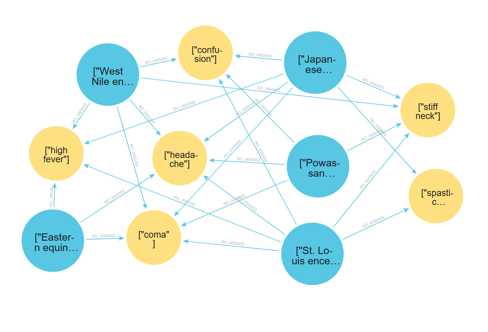

# 🧪 Testing the Explainable AI (XAI) Layer

## 📋 Overview

This section documents the evaluation of the Explainable AI (XAI) layer used in the NeSy-X framework. The role of this layer is not to perform independent diagnostic reasoning, but to transform the structured output of the symbolic layer into a clear explanation. The XAI layer receives candidate diseases, matched symptoms, missing symptoms, blocking symptoms, normalized scores, and the passed_filter status produced by the graph-based inference layer.

The central requirement is that the explanation must remain grounded in symbolic results. A disease with `passed_filter = false` must be placed in `excluded_condition`s, even if its normalized score is high. Similarly, missing symptoms must not be treated as blocking symptoms, because they represent symptoms that were not reported, not symptoms explicitly denied by the user.

---

## 📐 Evaluation Scenarios

### TC1 — Negated Symptoms

**Focus:** Explain why diseases with blocking symptoms are excluded.

| Field               | Value                                                                 |
|---------------------|-----------------------------------------------------------------------|
| Most Likely         | nonparalytic poliomyelitis (Passed Filter: True)                      |
| Differentials       | Ebola virus disease and poliomyelitis (Passed Filter: True)           |
| Excluded conditions | Marburg hemorrhagic fever and West Nile fever (Passed Filter: False)  |
| Blocking symptoms   | maculopapular rash and/or chills (patient denied both)                |

**Success criteria:** The reasoning must explicitly mention the absence of the rash as the reason for excluding West Nile fever and both rash and chills for Marburg hemorrhagic fever.

---

### TC2 — Similar Disease Profiles

**Focus:** Distinguish diseases with similar symptom profiles.

| Field               | Value                                                                  |
|---------------------|------------------------------------------------------------------------|
| Most Likely         | hepatitis E (Passed Filter: True)                                      |
| Differentials       | hepatitis B, hepatitis C and hepatitis A (Passed Filter: True)         |
| Excluded conditions | hepatitis D (Passed Filter: False)                                     |
| Blocking symptoms   | drowsiness and confusion (patient denied both)                         |

**Success criteria:** Model assigns High Confidence to Hepatitis E, explains that A, B, and C are less likely due to lower symptomatic alignment and mentions the absence of drowsiness and confusion as the reason for excluding hepatitis D.

---

### TC3 — Low Disease Coverage

**Focus:** Identify the most likely disease while acknowledging low coverage.

| Field               | Value                                                                              |
|---------------------|------------------------------------------------------------------------------------|
| Most Likely         | West Nile encephalitis (Passed Filter: True)                                       |
| Differentials       | Powassan encephalitis and Eastern equine encephalitis (Passed Filter: True)        |
| Excluded conditions | Japanese encephalitis and St. Louis encephalitis (Passed Filter: False)            |
| Blocking symptoms   | spastic paralysis (patient denied)                                                 |

**Success criteria:** Model identifies West Nile as the primary diagnosis despite low confidence, explicitly recommends further testing and mentions the absence of spastic paralysis as the reason for excluding Japanese encephalitis and St. Louis encephalitis.

---

### TC4 — Overlapping Symptoms Without Exclusions

**Focus:** Identify the symptom that differentiates the most likely disease from similar alternatives.

| Field               | Value                                                                                          |
|---------------------|------------------------------------------------------------------------------------------------|
| Most Likely         | Powassan encephalitis (Passed Filter: True)                                                    |
| Differentials       | nonparalytic poliomyelitis, La Crosse encephalitis and poliomyelitis (Passed Filter: True)     |
| Excluded conditions | —                                                                                              |
| Blocking symptoms   | —                                                                                              |

**Success criteria:** Model identifies seizure as the clinical tie-breaker that elevates Powassan encephalitis over the competing candidates.

---

## ⚙️ Test Environment

| Property   | Value                                              |
|------------|----------------------------------------------------|
| OS         | Windows-11-10.0.26200-SP0                          |
| CPU        | AMD64 Family 23 Model 113 Stepping 0, AuthenticAMD |
| RAM        | 17.1 GB                                            |
| GPU        | NVIDIA GeForce RTX 3060                            |
| VRAM       | 12.0 GB                                            |
| Python     | 3.12.9                                             |

---

## 🧪 Test 1: llama3.2:3b (local)

**Overall assessment:** The model followed the required JSON structure, but showed weak exclusion logic. It sometimes placed diseases with `passed_filter = false` among differentials or used missing symptoms as if they were blocking symptoms.

### ⏱️ Performance

| Test Case | Total Time |
|-----------|------------|
| TC1       | 34.96s     |
| TC2       | 21.46s     |
| TC3       | 29.74s     |
| TC4       | 22.61s     |
| **Total** | **108.77s**|

### 📊 Performance Matrix

| Metric                              | Result    | Commentary                                                              |
|-------------------------------------|-----------|-------------------------------------------------------------------------|
| JSON structural integrity           |  100%     | Perfectly followed the schema and maintained all keys                   |
| Exclusion logic (blocking symptoms) |  25%      | TC1: placed Marburg and West Nile in differentials; TC3: placed Japanese encephalitis and St. Louis encephalitis in differentials and in excluded conditions  |
| Internal consistency                |  Failed     | TC4: hallucinated exclusion of primary amebic meningoencephalitis (`exclusion_criteria`) despite passed_filter: true                              |
| Clinical tone                       |  High     | Medical vocabulary                              |

### 💬 Qualitative Analysis

**1. Negation & filter logic (TC1 & TC3)**

In TC3, the model correctly identifies West Nile encephalitis as the most likely diagnosis. However, it fails the logical constraint test by placing Japanese encephalitis and St. Louis encephalitis into the differential diagnosis category, completely ignoring the `passed_filter: false` flag. These conditions should have been moved to `excluded_conditions` due to the presence of the blocking symptom spastic paralysis, which the patient explicitly denied. Furthermore, the model incorrectly justifies their inclusion by claiming they have lower scores, when in fact, they had higher raw scores but were excluded.

**2. Hallucinated exclusion (TC4)**

In TC4, all five diseases have `passed_filter: true` and no blocking symptoms exist. Despite this, the model placed primary amebic meningoencephalitis in `excluded_conditions`, falsely claiming the patient denied coma — a symptom that appears only in the Missing List, not the Blocking Symptoms list. This is the same missing/blocking confusion as before.

---

## 🧪 Test 2: llama3:8b (local)

**Overall assessment:** `llama3:8b` followed the JSON structure correctly, but achieved only partial logical consistency. The main errors occurred when filtered diseases were placed among differentials or when missing symptoms were interpreted as exclusion reasons.

### ⏱️ Performance

| Test Case | Total Time |
|-----------|------------|
| TC1       | 22.45s     |
| TC2       | 21.07s     |
| TC3       | 20.36s     |
| TC4       | 22.66s     |
| **Total** | **86.54s** |

### 📊 Performance Matrix

| Metric                              | Result    | Commentary                                                                        |
|-------------------------------------|-----------|-----------------------------------------------------------------------------------|
| JSON structural integrity           |  100%     | Perfectly followed the schema and maintained all keys                             |
| Exclusion logic (blocking symptoms) |  50%      | TC1: Marburg in differentials, poliomyelitis incorrectly excluded |
| Internal consistency                |  Partial     | TC1 has contradictions    |
| Clinical tone                       |  High     | Medical vocabulary                                        |

### 💬 Qualitative Analysis

**1. Negation & filter logic (TC1, TC2 & TC3)**

In TC1, the model placed Marburg hemorrhagic fever in `differentials` despite its `passed_filter: false` flag. At the same time, it incorrectly excluded poliomyelitis — a disease with `passed_filter: true` — citing flaccid paralysis as a blocking symptom. Flaccid paralysis is listed under Missing List, not Blocking Symptoms, making this an unjustified exclusion.

**2. Correct handling (TC2, TC3, TC4)**

TC2 correctly excluded hepatitis D with the right justification. TC3 correctly placed Japanese encephalitis and St. Louis encephalitis in `excluded_conditions` citing spastic paralysis. TC4 correctly identified Powassan encephalitis as most likely with all others as differentials and an empty `excluded_conditions` list.

---

## 🧪 Test 3: mistral-nemo:12b (local)

**Overall assessment:** `mistral-nemo:12b` showed partial consistency. It handled several scenarios correctly, but still confused missing symptoms with blocking symptoms in at least one case.

### ⏱️ Performance

| Test Case | Total Time |
|-----------|------------|
| TC1       | 28.15s     |
| TC2       | 26.26s     |
| TC3       | 23.26s     |
| TC4       | 18.16s     |
| **Total** | **95.83s** |

### 📊 Performance Matrix

| Metric                              | Result   | Commentary                                                                                         |
|-------------------------------------|----------|----------------------------------------------------------------------------------------------------|
| JSON structural integrity           | 100%  | Perfectly followed the schema and maintained all keys                                        |
| Exclusion logic (blocking symptoms) | 50%  | TC1: West Nile fever in differentials, poliomyelitis incorrectly excluded;  |
| Internal consistency                | Partial | TC1 internally inconsistent;                                      |
| Clinical tone                       | High  | Medical vocabulary                                                                      |
### 💬 Qualitative Analysis

**1. Negation & filter logic (TC1)**

In TC1, West Nile fever (`passed_filter: false`) was placed in `differentials` instead of `excluded_conditions`. The model also incorrectly excluded poliomyelitis (`passed_filter: true`), justifying the exclusion with flaccid paralysis — which appears only in the Missing List and does not qualify as a blocking symptom.

**2. Correct handling (TC2, TC3, TC4)**

TC2 correctly excluded hepatitis D citing drowsiness and confusion. TC3 correctly excluded both Japanese and St. Louis encephalitis citing spastic paralysis. TC4 correctly identified Powassan encephalitis as most likely and included all other diseases as differentials with an empty excluded list.

**3. TC4 differential comparison quality**

In TC4, the model correctly identified seizure as absent from poliomyelitis and nonparalytic poliomyelitis, indirectly supporting Powassan encephalitis as the tie-breaker — though it did not explicitly name seizure as the deciding factor.

---

## 🧪 Test 4: phi4:14b (local)

**Overall assessment:** `phi4:14b` demonstrated strong logical compliance across all test cases. All diseases with `passed_filter = false` were correctly placed in excluded_conditions. TC4 now includes all four differentials correctly and explicitly references seizure and stiff neck as the tie-breaking symptoms for Powassan encephalitis.

### ⏱️ Performance

| Test Case | Total Time |
|-----------|------------|
| TC1       | 50.28s     |
| TC2       | 45.15s     |
| TC3       | 45.86s     |
| TC4       | 53.57s     |
| **Total** | **194.86s**|

### 📊 Performance Matrix

| Metric                              | Result   | Commentary                                                                                          |
|-------------------------------------|----------|-----------------------------------------------------------------------------------------------------|
| JSON structural integrity           | 100%  | Perfectly followed the schema and maintained all keys                                      |
| Exclusion logic (blocking symptoms) | 100%  | All passed_filter: false diseases correctly placed in excluded_conditions across all test cases      |
| Internal consistency                | High  | Textual reasoning directly supports the content of the JSON arrays                                  |
| Clinical tone                       | High  | Medical vocabulary                                                                       |
### 💬 Qualitative Analysis

**1. Precise handling of negation (TC1, TC2, TC3)**

In TC1, Marburg hemorrhagic fever and West Nile fever are correctly placed in `excluded_conditions`, with explicit references to the denied maculopapular rash and chills. In TC2, hepatitis D is correctly excluded citing drowsiness and confusion. In TC3, both Japanese and St. Louis encephalitis are correctly excluded citing spastic paralysis.

**2. TC4 tie-breaker identification**

In TC4, the model correctly identifies seizure and stiff neck as the symptoms that distinguish Powassan encephalitis from nonparalytic poliomyelitis and poliomyelitis, fulfilling the success criteria for this test case.

**3. Trade-off: accuracy vs speed**

Phi4 14b is the slowest local model tested, averaging nearly 49 seconds per test case. This is a significant trade-off compared to smaller models, and should be considered when evaluating it for production use.

---

## 🧪 Test 5: qwen2.5:14b (local)

**Overall assessment:** `qwen2.5:14b` demonstrated strong logical compliance across all test cases. All diseases with `passed_filter = false` were correctly placed in `excluded_conditions`, and the generated explanations remained internally consistent. TC4 confidence is set to `moderate` — a more conservative and arguably more appropriate calibration than the `high` assigned by phi4, given that Powassan encephalitis covers only 50% of its known symptoms.

### ⏱️ Performance

| Test Case | Total Time |
|-----------|------------|
| TC1       | 49.49s     |
| TC2       | 56.38s     |
| TC3       | 52.73s     |
| TC4       | 58.12s     |
| **Total** | **216.72s**|

### 📊 Performance Matrix

| Metric                              | Result    | Commentary                                                              |
|-------------------------------------|-----------|-------------------------------------------------------------------------|
| JSON structural integrity           |  100%     | Perfectly followed the schema and maintained all keys                   |
| Exclusion logic (blocking symptoms) |  100%     |  All passed_filter: false diseases correctly placed in excluded_conditions across all test cases |
| Internal consistency                |  High     | Textual reasoning directly supports the content of the JSON arrays      |
| Clinical tone                       |  High     | Medical vocabulary                              |

### 💬 Qualitative Analysis

**1. Precise handling of negation (TC1, TC2, TC3)**

In TC1, Marburg hemorrhagic fever and West Nile fever are correctly excluded citing denied maculopapular rash and chills. In TC2, hepatitis D is correctly excluded citing drowsiness and confusion. In TC3, Japanese and St. Louis encephalitis are correctly excluded citing spastic paralysis.

**2. TC4 differential comparison quality**

In TC4, the model explicitly names seizure as the differentiating symptom across all differential comparisons — noting its absence from nonparalytic poliomyelitis, poliomyelitis, La Crosse encephalitis, and primary amebic meningoencephalitis. This is the most thorough fulfillment of the TC4 success criteria among all tested models.

**3. Confidence calibration**

The `moderate` confidence assigned in TC4 reflects a correct reading of the data — Disease Coverage is 50% and Input Coverage is 100%, which places the case in the moderate band per the prompt definition. This is more precise than phi4's `high` assignment for the same scenario.

---

## 🧪 Test 6: meta-llama/llama-4-scout-17b-16e-instruct (cloud)

**Overall assessment:** `llama-4-scout-17`b demonstrated full logical compliance with the `passed_filter` flag and produced internally consistent explanations. Its most notable characteristic is its inference speed — completing each test case in approximately 1.3–1.4 seconds, significantly faster than any local model tested.

### ⏱️ Performance

| Test Case | Total Time |
|-----------|------------|
| TC1       | 1.44s      |
| TC2       | 1.32s      |
| TC3       | 1.21s      |
| TC4       | 1.41s      |
| **Total** | **5.38s**  |

### 📊 Performance Matrix

| Metric                              | Result    | Commentary                                                              |
|-------------------------------------|-----------|-------------------------------------------------------------------------|
| JSON structural integrity           |  100%     | Perfectly followed the schema and maintained all keys                   |
| Exclusion logic (blocking symptoms) |  100%      | All passed_filter: false diseases correctly placed in excluded_conditions across all test cases |
| Internal consistency                |  High     | Textual reasoning directly supports the content of the JSON arrays      |
| Clinical tone                       |  High     | Medical vocabulary                              |

### 💬 Qualitative Analysis

**1. Negation & filter logic (TC1, TC2 & TC3)**

In TC1, correctly places Marburg hemorrhagic fever and West Nile fever in `excluded_conditions`, explicitly citing the absence of maculopapular rash and chills as the deciding factors.

In TC2, Hepatitis D is correctly excluded with a precise explanation referencing the absence of drowsiness and confusion as mandatory markers.

In TC3, Japanese encephalitis and St. Louis encephalitis are correctly excluded, with the model clearly attributing the exclusion to the denied spastic paralysis.

---

## 🧪 Test 7: openai/gpt-oss-120b (cloud)

**Overall assessment:** The largest model tested demonstrates strong clinical reasoning and correct filter logic compliance. However, it exhibits the most pronounced **High-Intelligence Bias** — it consistently generates more nuanced and detailed reasoning than other models, sometimes at the cost of strict adherence to the simplified expected output format.

### ⏱️ Performance

| Test Case | Total Time |
|-----------|------------|
| TC1       | 2.95s      |
| TC2       | 2.24s      |
| TC3       | 11.88s     |
| TC4       | 33.34s     |
| **Total** | **50.41s** |

### 📊 Performance Matrix

| Metric                              | Result    | Commentary                                                              |
|-------------------------------------|-----------|-------------------------------------------------------------------------|
| JSON structural integrity           |  100%   | Perfectly followed the schema and maintained all keys                   |
| Exclusion logic (blocking symptoms) |  100%   | All `passed_filter: false` diseases correctly placed in `excluded_conditions` across all test cases  |
| Internal consistency                |  High   | Textual reasoning directly supports the content of the JSON arrays      |
| Clinical tone                       |  High   | Most detailed medical vocabulary                |

### 💬 Qualitative Analysis

**1. Negation & filter logic (TC1, TC2 & TC3)**

In TC1, correctly excludes Marburg hemorrhagic fever and West Nile fever, providing the most detailed blocking symptom explanation of all tested models.

In TC2, correctly excludes Hepatitis D with precise clinical justification referencing drowsiness and confusion.

In TC3, correctly excludes Japanese encephalitis and St. Louis encephalitis, citing spastic paralysis as the decisive blocking factor.

---

## 📊 Summary: Comparison of Model Performance

| Model            | Size  | Type  | JSON Integrity | Exclusion Logic | Internal Consistency | Clinical Tone | Total Time  |
|------------------|-------|-------|----------------|-----------------|----------------------|---------------|-------------|
| llama3.2:3b      | 3B    | Local | ✅ 100%        | ❌ 25%          | ❌ Fail              | ✅ High       | 108.77s     |
| llama3:8b        | 8B    | Local | ✅ 100%        | ⚠️ 50%          | ⚠️ Partial           | ✅ High       | 86.54s      |
| mistral-nemo:12b | 12B   | Local | ✅ 100%        | ⚠️ 50%          | ⚠️ Partial           | ✅ High       | 95.83s      |
| phi4:14b         | 14B   | Local | ✅ 100%        | ✅ 100%         | ✅ High              | ✅ High       | 194.86s     |
| **qwen2.5:14b**      | 14B   | Local | ✅ 100%        | ✅ 100%         | ✅ High              | ✅ High       | 216.72s     |
| meta-llama/llama-4-scout-17b-16e-instruct      | 17b-16e (MoE)   | Cloud | ✅ 100%        | ✅ 100%         | ✅ High              | ✅ High       | 5.38s     |
| openai/gpt-oss-120b      | 120B   | Cloud | ✅ 100%        | ✅ 100%         | ✅ High              | ✅ High       | 50.41s     |

---

## 🏁 Conclusion

The evaluation shows that the XAI layer can reliably transform symbolic inference results into structured explanations when the model follows the `passed_filter` logic and respects the distinction between matched, missing, and blocking symptoms. The main difference between models was not JSON formatting, but logical consistency in interpreting `passed_filter` and blocking symptoms.

A notable new finding is the introduction of **mistral-nemo:12b**, which performs on par with llama3:8b despite having 50% more parameters. Both achieve 50% exclusion logic accuracy, suggesting that parameter count alone is not the primary factor — instruction-following capability and training data quality play an equally important role.

Cloud models offer significantly faster inference — `llama-4-scout` completed all four test cases in just 5 seconds compared to 70–90 seconds for local 14B models. However, `gpt-oss-120b` showed variable latency (2.5s to 21s per case), suggesting that response depth impacts inference time more than model size alone.

For local execution, `qwen2.5:14b` is the most suitable model for the XAI layer. Although it is slower than several alternatives, it achieves full exclusion logic accuracy and high internal consistency.For cloud execution, `llama-4-scout-17b` is the strongest option among the tested models because it combines full logical compliance with the lowest execution time.

Within the NeSy-X framework, the XAI layer improves transparency by explaining why a disease was ranked, why alternatives remain possible, and why some diseases were excluded. Its output should be interpreted as an explanation of symbolic reasoning results, not as an independent medical diagnosis.

---

**⬅ Previous:** [🧪 Testing the Inference and Scoring Layer](./inference-and-scoring-test.md)
