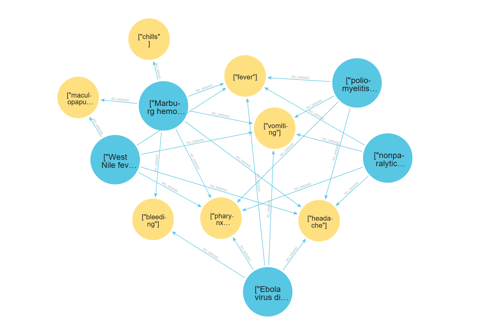
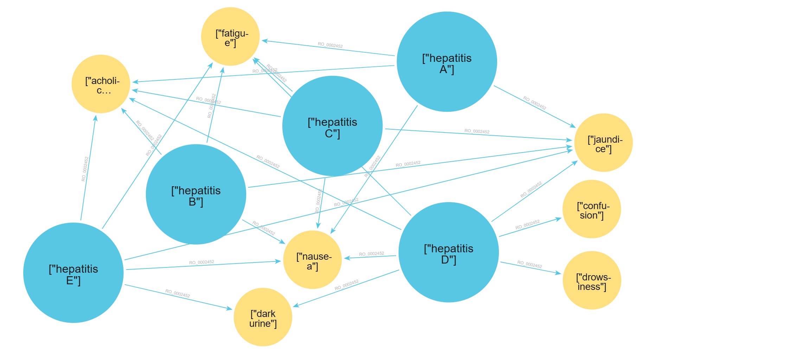
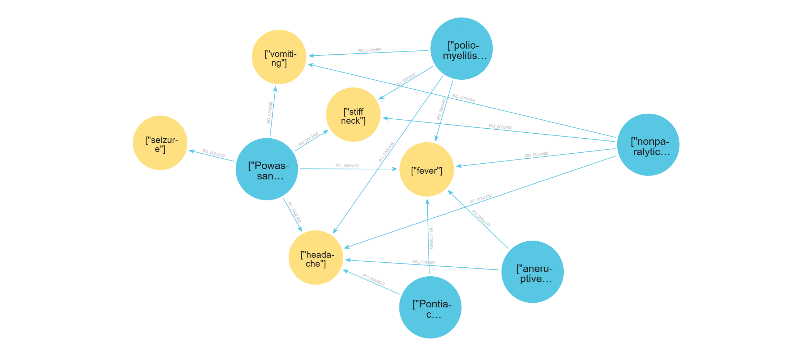

# 🧪 Testing the Explainable AI (XAI) Layer

## 📋 Overview

The Explainable AI (XAI) layer is evaluated using four distinct clinical scenarios generated by the Neo4j inference engine. These tests are designed to challenge the LLM's ability to handle logical negations (blocking symptoms), differential weighting, and confidence assessment.

---

## 📐 Test Cases

### TC1 — Negation Handling

**Focus:** Can the model correctly identify why a high-scoring disease was excluded?

| Field               | Value                                                                 |
|---------------------|-----------------------------------------------------------------------|
| Most Likely         | nonparalytic poliomyelitis (Passed Filter: True)                      |
| Differentials       | Ebola virus disease and poliomyelitis (Passed Filter: True)           |
| Excluded conditions | Marburg hemorrhagic fever and West Nile fever (Passed Filter: False)  |
| Blocking symptoms   | maculopapular rash and/or chills (patient denied both)                |

**Success criteria:** The reasoning must explicitly mention the absence of the rash as the reason for excluding West Nile fever and both rash and chills for Marburg hemorrhagic fever.

---

### TC2 — Broad Differential Diagnostic

**Focus:** Distinguishing between diseases with very similar symptom profiles.

| Field               | Value                                                                  |
|---------------------|------------------------------------------------------------------------|
| Most Likely         | hepatitis E (Passed Filter: True)                                      |
| Differentials       | hepatitis B, hepatitis C and hepatitis A (Passed Filter: True)         |
| Excluded conditions | hepatitis D (Passed Filter: False)                                     |
| Blocking symptoms   | drowsiness and confusion (patient denied both)                         |

**Success criteria:** Model assigns High Confidence to Hepatitis E, explains that A, B, and C are less likely due to lower symptomatic alignment and mentions the absence of drowsiness and confusion as the reason for excluding hepatitis D.

---

### TC3 — Low Disease Coverage

**Focus:** Managing high-severity cases with low disease coverage.

| Field               | Value                                                                              |
|---------------------|------------------------------------------------------------------------------------|
| Most Likely         | West Nile encephalitis (Passed Filter: True)                                       |
| Differentials       | Powassan encephalitis and Eastern equine encephalitis (Passed Filter: True)        |
| Excluded conditions | Japanese encephalitis and St. Louis encephalitis (Passed Filter: False)            |
| Blocking symptoms   | spastic paralysis (patient denied)                                                 |

**Success criteria:** Model identifies West Nile as the primary diagnosis despite low confidence, explicitly recommends further testing and mentions the absence of spastic paralysis as the reason for excluding Japanese encephalitis and St. Louis encephalitis.

---

### TC4 — Overlapping Symptoms

**Focus:** Handling overlapping symptoms where no conditions are excluded.

| Field               | Value                                                                                          |
|---------------------|------------------------------------------------------------------------------------------------|
| Most Likely         | Powassan encephalitis (Passed Filter: True)                                                    |
| Differentials       | nonparalytic poliomyelitis, La Crosse encephalitis and poliomyelitis (Passed Filter: True)     |
| Excluded conditions | —                                                                                              |
| Blocking symptoms   | —                                                                                              |

**Success criteria:** Model identifies seizure as the clinical tie-breaker that elevates Powassan encephalitis over the competing candidates.

---

## ⚙️ Test Environment

| Property   | Value                                              |
|------------|----------------------------------------------------|
| OS         | Windows-11-10.0.26200-SP0                          |
| CPU        | AMD64 Family 23 Model 113 Stepping 0, AuthenticAMD |
| RAM        | 17.1 GB                                            |
| GPU        | NVIDIA GeForce RTX 3060                            |
| VRAM       | 12.0 GB                                            |
| Python     | 3.12.9                                             |

---

## 🧪 Test 1: llama3.2:3b (local)

**Overall assessment:** Strong JSON structural compliance, but exhibits hallucinatory reasoning when it comes to the clinical filter logic provided in the input data.

### ⏱️ Performance

| Test Case | Total Time |
|-----------|------------|
| TC1       | 22.22s     |
| TC2       | 17.58s     |
| TC3       | 15.28s     |
| TC4       | 16.87s     |
| **Total** | **71.95s** |

### 📊 Performance Matrix

| Metric                              | Result    | Commentary                                                              |
|-------------------------------------|-----------|-------------------------------------------------------------------------|
| JSON structural integrity           |  100%     | Perfectly followed the schema and maintained all keys                   |
| Exclusion logic (blocking symptoms) |  50%      | Correctly identified Hepatitis D exclusion; failed on Japanese Encephalitis |
| Internal consistency                |  Fail     | In TC3, contradicts the input filter logic                              |
| Clinical tone                       |  High     | Medical vocabulary                              |

### 💬 Qualitative Analysis

**1. Negation & filter logic (TC1 & TC3)**

In TC3, the model correctly identifies West Nile encephalitis as the most likely diagnosis. However, it fails the logical constraint test by placing Japanese encephalitis and St. Louis encephalitis into the differential diagnosis category, completely ignoring the `passed_filter: false` flag. These conditions should have been moved to `excluded_conditions` due to the presence of the blocking symptom spastic paralysis, which the patient explicitly denied. Furthermore, the model incorrectly justifies their inclusion by claiming they have lower scores, when in fact, they had higher raw scores but were excluded.

**2. Differential comparison (TC2 & TC4)**

TC2 was handled well. The model correctly identified Hepatitis D's exclusion based on the absence of drowsiness and confusion.

In TC4, the model ranked Powassan encephalitis correctly but did not explicitly name seizure as the clinical tie-breaker.

**3. Safety & clinical recommendations**

Across all test cases the model consistently appended relevant next steps (e.g., CSF analysis, PCR for flavivirus). This suggests its medical pre-training knowledge is being used to enrich explanations beyond the provided JSON — a useful behaviour, as long as it does not override or contradict the input data.

---

## 🧪 Test 2: llama3:8b (local)

**Overall assessment:** Successfully generates valid JSON structures and writes highly professional, clinically coherent paragraphs. However, it exhibits a severe inability to correctly map the logical `passed_filter` flag to the appropriate JSON arrays, leading to contradictory outputs where the text explains a disease is excluded, but the array lists it as a viable differential.

### ⏱️ Performance

| Test Case | Total Time |
|-----------|------------|
| TC1       | 23.74s     |
| TC2       | 16.51s     |
| TC3       | 17.08s     |
| TC4       | 18.71s     |
| **Total** | **76.04s** |

### 📊 Performance Matrix

| Metric                              | Result    | Commentary                                                                        |
|-------------------------------------|-----------|-----------------------------------------------------------------------------------|
| JSON structural integrity           |  100%     | Perfectly followed the schema and maintained all keys                             |
| Exclusion logic (blocking symptoms) |  25%      | Recognized blocking symptoms in text, but placed diseases in the wrong categories |
| Internal consistency                |  Fail     | Massive semantic disconnect — the text frequently contradicts the JSON arrays     |
| Clinical tone                       |  High     | Medical vocabulary                                        |

### 💬 Qualitative Analysis

**1. Negation & filter logic (TC1, TC2 & TC3)**

In TC1, it places Marburg hemorrhagic fever in the differentials, completely ignoring the `passed_filter: false` flag. Additionally, poliomyelitis should be in differentials, not in `excluded_conditions`.

In TC2, it places Hepatitis D in differentials, but then correctly writes in the `exclusion_criteria` paragraph that Hepatitis D was "rejected due to the presence of blocking symptoms".

In TC3, it completely inverts the logic: it places the excluded diseases (Japanese encephalitis and St. Louis encephalitis) into the differentials array, and puts valid differentials (Powassan encephalitis and Eastern equine encephalitis) into the `excluded_conditions` array.

**2. Hallucinated Constraints (TC4)**

In TC4, all diseases passed the filter (no blocking symptoms were triggered). However, the model forced La Crosse encephalitis and primary amebic meningoencephalitis into the `excluded_conditions` array. To justify this, it hallucinated that blocking symptoms were present, stating: *"La Crosse… excluded due to their lower scores and the presence of blocking symptoms."* It clearly confused "missing symptoms" with "blocking symptoms".

---

## 🧪 Test 3: qwen2.5:14b (local)

**Overall assessment:** Qwen 2.5 (14b) shows a significant leap in performance compared to Llama 3 (8b), particularly in logical consistency and adherence to rigid system rules. While Llama often "hallucinated" reasons for exclusion to justify its placement errors, Qwen demonstrates much stricter compliance with the `passed_filter` flag.

### ⏱️ Performance

| Test Case | Total Time |
|-----------|------------|
| TC1       | 23.65s     |
| TC2       | 21.87s     |
| TC3       | 20.22s     |
| TC4       | 21.47s     |
| **Total** | **87.21s** |

### 📊 Performance Matrix

| Metric                              | Result    | Commentary                                                              |
|-------------------------------------|-----------|-------------------------------------------------------------------------|
| JSON structural integrity           |  100%     | Perfectly followed the schema and maintained all keys                   |
| Exclusion logic (blocking symptoms) |  100%     | Accurately identifies `passed_filter: false` and correctly maps diseases to `excluded_conditions` |
| Internal consistency                |  High     | Textual reasoning directly supports the content of the JSON arrays      |
| Clinical tone                       |  High     | Medical vocabulary                              |

### 💬 Qualitative Analysis

**1. Precise Handling of Negation (TC1, TC2, & TC3)**

In TC1, correctly places Marburg hemorrhagic fever in `excluded_conditions`. In the text, it explicitly states the disease is excluded due to the absence of a rash and chills, showing that the model "understands" that `passed_filter: false` takes priority over a high score.

In TC2, Hepatitis D is correctly excluded. The reasoning is precise: it notes that drowsiness and confusion are mandatory markers that are missing, which directly justifies its placement in the excluded list.

In TC3, the model successfully resolves the "inversion" problem. Japanese encephalitis and St. Louis encephalitis are correctly classified as excluded, with a clear explanation regarding the blocking symptom (spastic paralysis).

---

## 🧪 Test 4: phi4:14b (local)

**Overall assessment:** Phi 4 (14b) shows a high level of logical maturity.

### ⏱️ Performance

| Test Case | Total Time |
|-----------|------------|
| TC1       | 25.02s     |
| TC2       | 22.12s     |
| TC3       | 24.37s     |
| TC4       | 21.31s     |
| **Total** | **92.82s** |

### 📊 Performance Matrix

| Metric                              | Result    | Commentary                                                              |
|-------------------------------------|-----------|-------------------------------------------------------------------------|
| JSON structural integrity           |  100%   | Perfectly followed the schema and maintained all keys                   |
| Exclusion logic (blocking symptoms) |  100%   | Accurately identifies `passed_filter: false` and correctly maps diseases to `excluded_conditions` |
| Internal consistency                |  High   | Textual reasoning directly supports the content of the JSON arrays      |
| Clinical tone                       |  High   | Medical vocabulary                              |

### 💬 Qualitative Analysis

**1. Precise Handling of Negation (TC1, TC2, & TC3)**

In cases where a disease has a high `normalized_score` but is marked as `passed_filter: false`, Phi-4 successfully excludes that disease.

For example, in TC1, even though Marburg hemorrhagic fever matches 5 out of 5 symptoms, Phi-4 correctly excludes it, explicitly stating that the absence of a maculopapular rash and chills is the deciding factor. TC2 and TC3 show the same behaviour.

---

## 🧪 Test 5: meta-llama/llama-4-scout-17b-16e-instruct (cloud)

**Overall assessment:** The cloud-hosted Llama 4 Scout demonstrates strong logical compliance with the `passed_filter` flag and delivers clinically coherent reasoning. Its most notable characteristic is its inference speed — completing each test case in approximately 1.2–1.3 seconds, significantly faster than any local model tested.

### ⏱️ Performance

| Test Case | Total Time |
|-----------|------------|
| TC1       | 1.19s      |
| TC2       | 1.30s      |
| TC3       | 1.24s      |
| TC4       | 1.29s      |
| **Total** | **5.02s**  |

### 📊 Performance Matrix

| Metric                              | Result    | Commentary                                                              |
|-------------------------------------|-----------|-------------------------------------------------------------------------|
| JSON structural integrity           |  100%     | Perfectly followed the schema and maintained all keys                   |
| Exclusion logic (blocking symptoms) |  75%      | Correctly handled TC1, TC2, TC3; incorrectly excluded La Crosse encephalitis and primary amebic meningoencephalitis in TC4 despite `passed_filter: true` |
| Internal consistency                |  High     | Textual reasoning directly supports the content of the JSON arrays      |
| Clinical tone                       |  High     | Professional language / medical vocabulary                              |

### 💬 Qualitative Analysis

**1. Negation & filter logic (TC1, TC2 & TC3)**

In TC1, correctly places Marburg hemorrhagic fever and West Nile fever in `excluded_conditions`, explicitly citing the absence of maculopapular rash and chills as the deciding factors.

In TC2, Hepatitis D is correctly excluded with a precise explanation referencing the absence of drowsiness and confusion as mandatory markers.

In TC3, Japanese encephalitis and St. Louis encephalitis are correctly excluded, with the model clearly attributing the exclusion to the denied spastic paralysis.

**2. Differential comparison (TC4)**

In TC4, the model correctly identifies Powassan encephalitis as most likely but places La Crosse encephalitis and primary amebic meningoencephalitis in `excluded_conditions` despite both having `passed_filter: true`. This represents a logical inconsistency — the model penalized them based on lower scores rather than blocking symptoms.

---

## 🧪 Test 6: openai/gpt-oss-120b (cloud)

**Overall assessment:** The largest model tested demonstrates strong clinical reasoning and correct filter logic compliance. However, it exhibits the most pronounced **High-Intelligence Bias** — it consistently generates more nuanced and detailed reasoning than other models, sometimes at the cost of strict adherence to the simplified expected output format.

### ⏱️ Performance

| Test Case | Total Time |
|-----------|------------|
| TC1       | 2.53s      |
| TC2       | 5.03s      |
| TC3       | 21.14s     |
| TC4       | 10.29s     |
| **Total** | **38.99s** |

### 📊 Performance Matrix

| Metric                              | Result    | Commentary                                                              |
|-------------------------------------|-----------|-------------------------------------------------------------------------|
| JSON structural integrity           |  100%   | Perfectly followed the schema and maintained all keys                   |
| Exclusion logic (blocking symptoms) |  100%   | Correctly maps `passed_filter: false` diseases to `excluded_conditions` |
| Internal consistency                |  High   | Textual reasoning directly supports the content of the JSON arrays      |
| Clinical tone                       |  High   | Most detailed medical vocabulary                |

### 💬 Qualitative Analysis

**1. Negation & filter logic (TC1, TC2 & TC3)**

In TC1, correctly excludes Marburg hemorrhagic fever and West Nile fever, providing the most detailed blocking symptom explanation of all tested models.

In TC2, correctly excludes Hepatitis D with precise clinical justification referencing drowsiness and confusion.

In TC3, correctly excludes Japanese encephalitis and St. Louis encephalitis, citing spastic paralysis as the decisive blocking factor.

**2. Confidence calibration (TC4)**

In TC4, uniquely assigns `low` confidence to Powassan encephalitis despite it being the top-ranked disease. This reflects a more conservative and arguably more clinically appropriate approach — acknowledging that when all diseases pass the filter and scores are close, certainty should be lower. All other models assigned `high` confidence in this scenario.

**3. High-Intelligence Bias**

TC3 took 21.14 seconds — significantly longer than other test cases — likely due to the model generating an unusually detailed and comprehensive reasoning section. This verbosity, while clinically valuable, indicates that larger models may trade inference speed for depth of analysis.

---

## 📊 Summary: Comparison of Model Performance

| Model                                     | Size  | Type  | JSON Integrity | Exclusion Logic | Internal Consistency | Clinical Tone | Total Time |
|-------------------------------------------|-------|-------|----------------|-----------------|----------------------|---------------|------------|
| llama3.2:3b                               | 3B    | Local | ✅ 100%        | ⚠️ 50%          | ❌ Fail              | ✅ High       | 71.95s     |
| llama3:8b                                 | 8B    | Local | ✅ 100%        | ❌ 25%          | ❌ Fail              | ✅ High       | 76.04s     |
| qwen2.5:14b                               | 14B   | Local | ✅ 100%        | ✅ 100%         | ✅ High              | ✅ High       | 87.21s     |
| phi4:14b                                  | 14B   | Local | ✅ 100%        | ✅ 100%         | ✅ High              | ✅ High       | 92.82s     |
| meta-llama/llama-4-scout-17b-16e-instruct | 17B   | Cloud | ✅ 100%        | ⚠️ 75%          | ✅ High              | ✅ High       | 5.02s      |
| openai/gpt-oss-120b                       | 120B  | Cloud | ✅ 100%        | ✅ 100%         | ✅ High              | ✅ High       | 38.99s     |

---

## 🏁 Conclusion

The results reveal a clear performance threshold at the **14B parameter range**, where both `qwen2.5:14b` and `phi4:14b` achieve full compliance with the symbolic filter logic. Models below this threshold (3B, 8B) consistently fail to correctly map the `passed_filter` flag to the appropriate output arrays, despite being able to describe the exclusion logic correctly in prose.

Cloud models offer significantly faster inference — `llama-4-scout` completed all four test cases in just 5 seconds compared to 70–90 seconds for local 14B models. However, `gpt-oss-120b` showed variable latency (2.5s to 21s per case), suggesting that response depth impacts inference time more than model size alone.

For production use, `qwen2.5:14b` represents the optimal local model — combining full logical compliance with reasonable inference speed. For cloud deployments where latency is critical, `llama-4-scout-17b` is the preferred choice.
